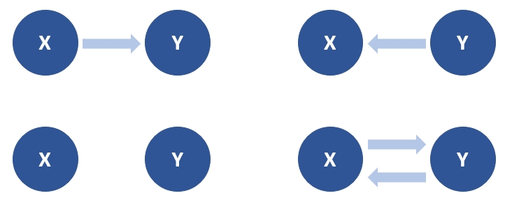
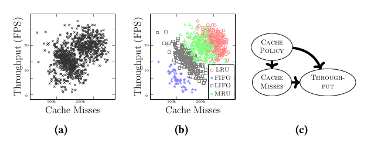
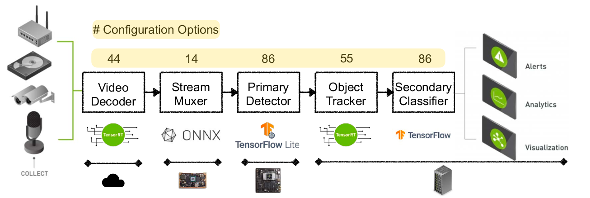
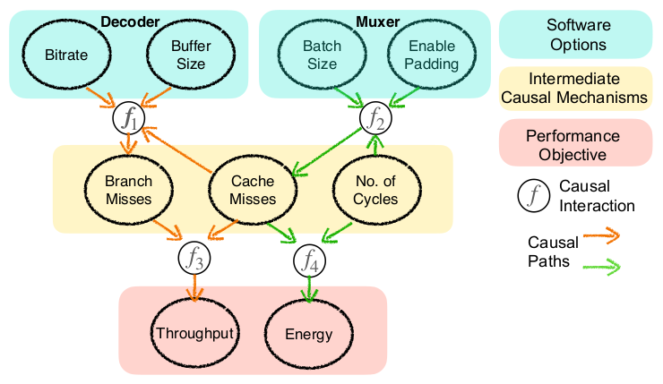

# Notes

## Introduction

- Systeme bestehen aus mehreren Komponenten mit jeweils eigenen Konfigurationen
- Der Konfigurationsraum ist sehr groß
- Entwickler und Endnutzer sind daher mit der Konfiguration überfordert

- Falsche Konfigurationen (*misconfigurations*) rufen unerwartete Interaktionen zwischen Software und Hardware hervor, was zu nicht-funktionalen Fehlern (z.B. Performanceeinbrüchen, höhere Latenz, mehr Energieverbrauch) führt

- Performance-Influence-Modelle messen, wie sich Konfigurationsparameter auf die Performance eines Systems auswirken
- häufig verwendet man Performance-Influence-Modelle wie Regression um den Einfluss individueller Optionen zu messen und zu erklären
- diese Modelle sind allerdings in unbekannten Environments unzuverlässig und produzieren falsche Erklärungen

- Definition *kausale Inferenz*: Zwei Zufallsvariablen X und Y stehen in einer kausalen Beziehung, so dass entweder X -> Y oder Y -> X gilt. Ausgehend von Beobachtungen x,y der beiden Zufallsvariablen, ist die kausale Richtung X -> Y oder Y -> X?

- Unterschied Korrelation & Kausalität:
  - Beispiel Anteil Nobelpreisträger und Schokoladenkonsum in einem Land
  - Auch wenn in einer Analyse eine statistisch signifikante Assoziation heraus kommt, so muss Schokoladenkonsum nicht ursächlich für den Anteil der Nobelpreisträger sein
  - Würde der Anteil der Nobelpreisträger steigen, wenn man die Bevölkerung zwingt, mehr Schokolade zu essen? Nein, weil kein Ursache-Wirkung Zusammenhang besteht
  - Kausale Inferenz versucht, Ursache-Wirkung zusammenhänge aufzudecken

- die Methode des Papers erlaubt Schlussfolgerungen über die Performance von konfigurierbaren Systemen mithilfe
- UNICORN erstellt zunächst die zugrunde liegende kausale Struktur aus den Leistungsdaten
- dieses kausale Modell erlaubt den Nutzer
    1. die Ursprünge von Performanceinbrüchen zu finden
    2. den kausalen Einfluss von Konfigurationsparametern auf die Performance einzuschätzen
    3. Konfigurationen für die Behebung der Performanceeinbrüche zu beheben oder die Systemperformance zu optimieren

## Motivating Scenarios

- Motivierendes Szenario:
  - gesammelte Daten deuten darauf hin, dass es eine Korrelation zwischen **Durchsatz** und **Cache Misses** gibt
  - ein darauf trainiertes Modell würde vorhersagen, dass mehr Cache Misses zu einen höheren Durchsatz führen, was Unsinn ist
  - tatsächlich besteht kein kausaler Zusammenhang zwischen Cache Misses und Durchsatz
  - im Hintergrund wurde die Caching Policy des Systems angepasst, um die Performance zu verbessern

  

- Deepstream ist eine eine Data Analytics Pipeline bestehend aus mehreren Komponenten, die jeweils sehr viele Konfigurationsparameter besitzen

- Fokus des Papers:
  - Performance Debugging: man beobachtet Performanceprobleme (z.B. Latenz) und versucht eine bessere Konfiguration zu finden, die das Problem behebt
  - Performance Optimization: es gibt kein Performanceproblem aber man möchte möglichst optimale Performance, indem man eine Konfiguration findet, die einen möglichst guten Trade-Off z.B. zwischen Durchsatz und Energieverbrauch erlaubt

## Causal Reasoning for Systems

- es zeigt sich, dass korrelationsbasierte Modelle zwar relativ genaue Vorhersagen in dem Environment ermöglichen, wo die Trainingsdaten herkommen, sich das Modell aber nicht auf bisher unbekannte Environments übertragen lässt

- Ziel in dem Paper ist es, ein kausales Modell zu entwerfen, das als Abstraktion dient um wiederverwendbare Performancemodelle zu bauen

- hierfür werden probabilistische graphische Modelle genutzt (z.B. Bayes'sche Netze, Markov-Modelle, siehe <https://de.wikipedia.org/wiki/Probabilistische_Graphische_Modelle>)
- diese graphischen Modelle bestehen aus
  - Performancevariablen
  - funktionale Knoten die funktionale Abhängigkeiten zwischen Performancevariablen definieren
  - kausale Verbindungen die Performanceknoten miteinander mittels funktionaler Knoten verbinden
  - Constraints die Annahmen definieren, die für das Performance Modeling notwendig sind (z.B. Cache Misses ist eine Performancevariable die nur positive ganze Zahlen annehmen kann)

- es werden drei Variablentypen definiert:
  - Software-Level Konfigurationsoiptionen die mit einer Software-Komponente assoziiert werden (z.B. Bitrate in der Decoder-Komponente von Deepstream) und Harware-Level Optionen (z.B. CPU-Frequenz)
  - Performancevariablen die einen Zusammenhang zwischen dem Einfluss von Konfigurationsoptionen und Performance Objectives herstellen (z.B. Cache Misses)
  - End-To-End Performance Objectives (z.B. Durchsatz)

## 4 UNICORN

- 5 Stufen
    1. Spezifikation des Performance-Optimization-Tasks in menschenlesbarer Form durch den Nutzer
    2. Hauptprozess sammelet vordefinierte Anzahl an Samples und lern kausales Performance-Modell (z.B. Systemkonfiguration und Messung)
    3. Bestimmung der nächsten Konfiguration und Messen der Systemperformance
    4. Das Performance-Modell wird inkrement geupdated um die dahinterliegende kausale Struktur abzubilden
    5.
- Schritte 3 und 4 wiederholen sich, bis das Budget (z.B. Zeit) überschritten  oder die gleiche Konfiguration mehrfach gewählt wurde
