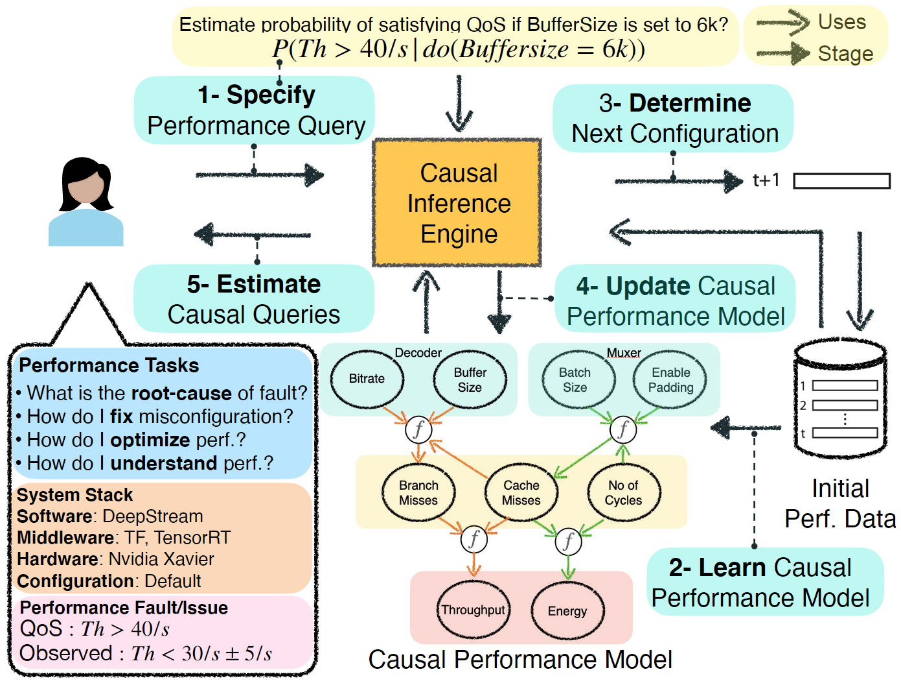
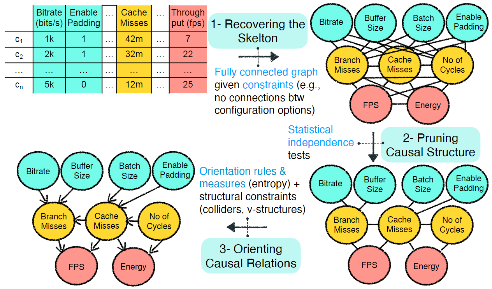
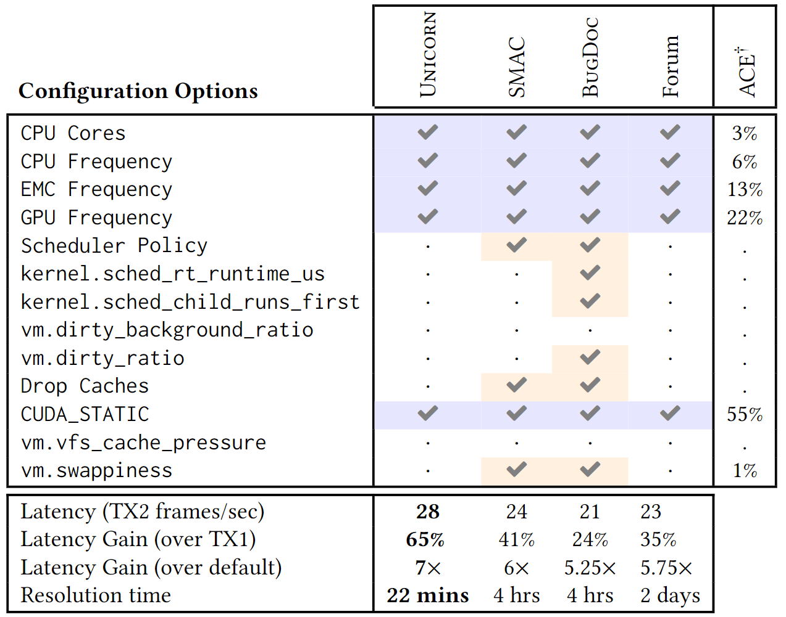
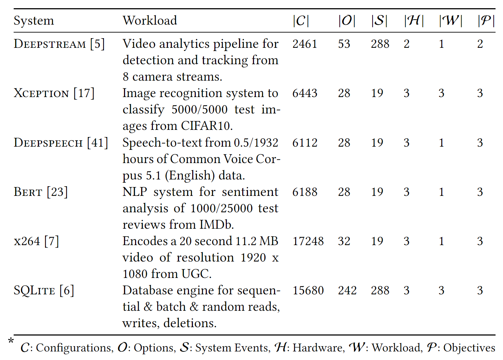
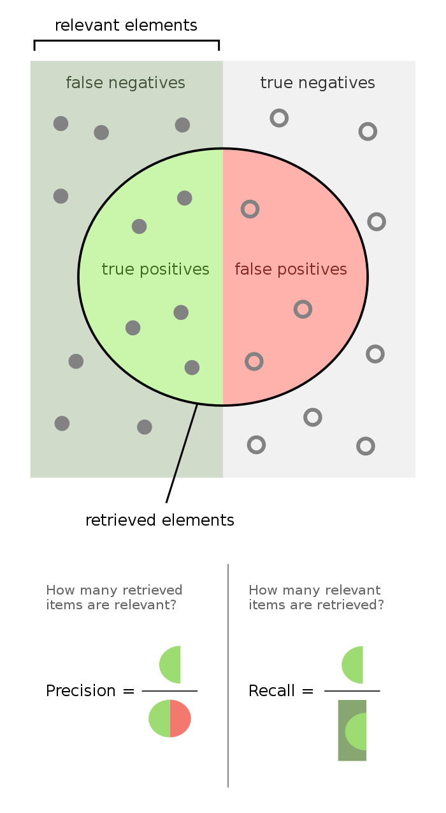

# Notes

## Introduction

- Systeme bestehen aus mehreren Komponenten mit jeweils eigenen Konfigurationen
- Der Konfigurationsraum ist sehr groß
- Entwickler und Endnutzer sind daher mit der Konfiguration überfordert

- Falsche Konfigurationen (*misconfigurations*) rufen unerwartete Interaktionen zwischen Software und Hardware hervor, was zu nicht-funktionalen Fehlern (z.B. Performanceeinbrüchen, höhere Latenz, mehr Energieverbrauch) führt

- Performance-Influence-Modelle messen, wie sich Konfigurationsparameter auf die Performance eines Systems auswirken
- häufig verwendet man Performance-Influence-Modelle wie Regression um den Einfluss individueller Optionen zu messen und zu erklären
- diese Modelle sind allerdings in unbekannten Environments unzuverlässig und produzieren falsche Erklärungen

- Definition *kausale Inferenz*: Zwei Zufallsvariablen X und Y stehen in einer kausalen Beziehung, so dass entweder X -> Y oder Y -> X gilt. Ausgehend von Beobachtungen x,y der beiden Zufallsvariablen, ist die kausale Richtung X -> Y oder Y -> X?

- Unterschied Korrelation & Kausalität:
  - Beispiel Anteil Nobelpreisträger und Schokoladenkonsum in einem Land
  - Auch wenn in einer Analyse eine statistisch signifikante Assoziation heraus kommt, so muss Schokoladenkonsum nicht ursächlich für den Anteil der Nobelpreisträger sein
  - Würde der Anteil der Nobelpreisträger steigen, wenn man die Bevölkerung zwingt, mehr Schokolade zu essen? Nein, weil kein Ursache-Wirkung Zusammenhang besteht
  - Kausale Inferenz versucht, Ursache-Wirkung zusammenhänge aufzudecken

- die Methode des Papers erlaubt Schlussfolgerungen über die Performance von konfigurierbaren Systemen mithilfe
- UNICORN erstellt zunächst die zugrunde liegende kausale Struktur aus den Leistungsdaten
- dieses kausale Modell erlaubt den Nutzer
    1. die Ursprünge von Performanceinbrüchen zu finden
    2. den kausalen Einfluss von Konfigurationsparametern auf die Performance einzuschätzen
    3. Konfigurationen für die Behebung der Performanceeinbrüche zu beheben oder die Systemperformance zu optimieren

## Motivating Scenarios

- Motivierendes Szenario:
  - gesammelte Daten deuten darauf hin, dass es eine Korrelation zwischen **Durchsatz** und **Cache Misses** gibt
  - ein darauf trainiertes Modell würde vorhersagen, dass mehr Cache Misses zu einen höheren Durchsatz führen, was Unsinn ist
  - tatsächlich besteht kein kausaler Zusammenhang zwischen Cache Misses und Durchsatz
  - im Hintergrund wurde die Caching Policy des Systems angepasst, um die Performance zu verbessern

  

- Deepstream ist eine eine Data Analytics Pipeline bestehend aus mehreren Komponenten, die jeweils sehr viele Konfigurationsparameter besitzen

- Fokus des Papers:
  - Performance Debugging: man beobachtet Performanceprobleme (z.B. Latenz) und versucht eine bessere Konfiguration zu finden, die das Problem behebt
  - Performance Optimization: es gibt kein Performanceproblem aber man möchte möglichst optimale Performance, indem man eine Konfiguration findet, die einen möglichst guten Trade-Off z.B. zwischen Durchsatz und Energieverbrauch erlaubt

## Causal Reasoning for Systems

- es zeigt sich, dass korrelationsbasierte Modelle zwar relativ genaue Vorhersagen in dem Environment ermöglichen, wo die Trainingsdaten herkommen, sich das Modell aber nicht auf bisher unbekannte Environments übertragen lässt

- Ziel in dem Paper ist es, ein kausales Modell zu entwerfen, das als Abstraktion dient um wiederverwendbare Performancemodelle zu bauen

- hierfür werden probabilistische graphische Modelle genutzt (z.B. Bayes'sche Netze, Markov-Modelle, siehe <https://de.wikipedia.org/wiki/Probabilistische_Graphische_Modelle>)
- diese graphischen Modelle bestehen aus
  - Performancevariablen
  - funktionale Knoten die funktionale Abhängigkeiten zwischen Performancevariablen definieren
  - kausale Verbindungen die Performanceknoten miteinander mittels funktionaler Knoten verbinden
  - Constraints die Annahmen definieren, die für das Performance Modeling notwendig sind (z.B. Cache Misses ist eine Performancevariable die nur positive ganze Zahlen annehmen kann)

- es werden drei Variablentypen definiert:
  - Software-Level Konfigurationsoiptionen die mit einer Software-Komponente assoziiert werden (z.B. Bitrate in der Decoder-Komponente von Deepstream) und Harware-Level Optionen (z.B. CPU-Frequenz)
  - Performancevariablen die einen Zusammenhang zwischen dem Einfluss von Konfigurationsoptionen und Performance Objectives herstellen (z.B. Cache Misses)
  - End-To-End Performance Objectives (z.B. Durchsatz)

## 4 UNICORN

- 5 Stufen
    1. Spezifikation des Performance-Optimization-Tasks in menschenlesbarer Form durch den Nutzer
    2. Hauptprozess sammelet vordefinierte Anzahl an Samples und lern kausales Performance-Modell (z.B. Systemkonfiguration und Messung)
    3. Bestimmung der nächsten Konfiguration und Messen der Systemperformance
    4. Das Performance-Modell wird inkrement geupdated um die dahinterliegende kausale Struktur abzubilden
    5.
- Schritte 3 und 4 wiederholen sich, bis das Budget (z.B. Zeit) überschritten  oder die gleiche Konfiguration mehrfach gewählt wurde

### Stufe 1

- Unicorn ermöglicht
  - Performance Debugging
  - Optimierung
  - Tuning
- es können die Fragen beantworten:
  - welche Konfigurationsoption ist für die Performanceprobleme verantwortlich
  - welche sind wichtige Optionen und deren Einfluss auf die Performance der Software?
  - wie lässt sich ein Qualitätsmerkmal optimieren bzw. ein Tradeoff zwischen mehreren Qualitätsmerkmalen auf zuverlässige und nachvollziehbare Weise herstellen?
  - wie lässt sich Nachvollziehen, welche Optionen und mögliche Interaktionen am meisten für die Performanceeinbrüche verantwortlich sind?

### Stufe 2

- Unicorn verwendet *Fast Causal Inference* (FCI) um kausale Zusammenhänge zu finden
- FCI wurde gewählt, weil
  - es berücksichtigt die Existenz von unbeobachteten Störfaktoren
  - erlaubt Variablen unterschiedlicher Typen
- jede Konfiguration wird mehrfach gemessen und der Median ermittelt
- um die kausalen Zusammenhänge zu erlernen gibt es 3 Schritte:
    1. Bilden eines vollständigen Graphen unter Berücksichtigung von Constraints (z.B: keine Verbindungen zwischen Konfigurationen)
    2. Entfernen von Kanten zwischen statistisch unabhängigen Knoten
    3. Orientierung der Kanten

    

#### Orientierung von ungerichteten Kanten

- es entsteht ein partieller Abstammungsgraph (*partial ancestral graph*) mit folgenden Kanten:
  - X -> Y: X verursacht Y
  - X <-> Y: es gibt ungemessene Störfaktoren zwischen X und Y
  - X o-> Y: entweder X verursacht Y oder es gibt ungemessene Störfaktoren die sowohl X als auch Y verursachen
  - X o-o Y: entweder X verusacht Y, Y verursacht X oder es gibt ungemessene Störfaktoren, die sowohl X als auch Y verursachen
- der Kreis bedeutet, dass möglicherweise eine Pfeilspitze vorliegen könnte (oder auch nicht)

### Auflösen partiell gerichteter Kanten

- es müssen die ungewissen Kantenenden (also die Kreise) aufgelöst werden
- dafür wird die Entropie untersucht

### Iteratives Sampeln (Active Learning)

- nun wird die nächste Konfiguration zum Messen ausgewählt
- dafür wird zunächst der Effekt der Konfigurationsoptionen auf die Optimierungs-Tasks ermittelt
- dieser Einfluss wird als Heuristik herangezogen, um die nächste Systemkonfiguration zu bestimmen
- es werden die Konfigurationesoptionen gewählt die einen größeren kausalen Zusammenhang besitzen, da diese meist einen größeren Einfluss auf die Performance haben und man dadurch mehr über den Einfluss auf die Performance des Systems lernen kann

- aus dem kausalen Graphen werden kausale Pfade extrahiert und geranked entsprechend ihrem durchschnittlichen kausalen Einfluss auf Latenz und Energieverbrauch

- ein kausaler Pfad ist ein gerichteter Pfad von einer Konfigurationsoption oder einem Systemereginis zu einer nicht-funktionalen Anforderung (z.B. Durchsatz oder Energieverbrauch)
- für das Finden solcher Pfade verwendet man Backtracking bis man bei einem Knoten ankommt, der keine eingehenden Kanten besitzt
- dabei entstehen bei Abzweigungen jeweils eigene Pfade

- die kausalen Pfade werden nach dem Einfluss von Änderungen an einem Knoten auf die Nachfolgeknoten im Pfad geranked

### Udpaten des kausalen Performance-Modells

- in jeder Iteration wird das Modell inkrementell geupdated

### Abschätzen der Anfrage des Nutzers

- aus dem gerlernten kausalen Performance-Modell wird eine quantitative Abschätzung der vom Nutzer gestellten Anfrage durchgeführt
- außerdem wird dem Nutzer Feedback zu unbeantwortbaren Fragen gegeben, damit der Nutzer dem System notwendige Informationen mitteilen kann

## Case Study

- Szenario: Entwickler wechselt von NVIDIA TX1 zu TX2 und bemerkt eine 4 mal schlechtere Latenz; der Grund sind falsche Konfigurationen (1 Kompileroption, 4 Hardwareoptionen)

- Unicorn wird verglichen mit:
  - der Empfehlung im NVIDIa-Forum
  - BugDoc
  - SMAC

- Unicorn ist besser als BugDoc und SMAC, da frühzeitig unrelevante Konfigurationsoptionen als irrelevant erkannt werden
- relevante Konfigurationen haben einen hohen *averace casual effect* (ACE) in der Tabelle (letzte Spalte)

## Evaluation

- es wurden 6 konfigurierbare Systeme getestet:
  - eine Video Analytics Pipeline
  - drei Deep-Learning-Systeme (für Bilder, gesprochene Sprache und NLP)
  - ein Video Encoder
  - eine Datenbank
- diese Systeme wurden auf 3 Hardwarekomponenten getestet:
  - NVIDIA TX1 und TX2
  - Xavier

- damit die Ergebnise repliziert werden können wurden manche Parameter festgesetzt (z.B. dynamische Spannung und Frequenz)

- Unicorn wird für Performance Debugging und Reparatur sowieo Performance Optimierung evaluiert
- Unicorn wird dabei verglichen mit:
  - CBI (statistische Methode die einen Feature Selection Algorithmus verwendet)
  - DD (Methode die die Differenz zwischen Paaren von Konfigurationen minimiert)
  - EnCore (verwendet Korrelationsfinformationen um Fehlkonfigurationen zu finden)
  - BugDoc (eine Fehlersuchmethode, die Rückschlüsse auf die Grundursachen ableitet und kurz gefasste Erklärungen für Fehler liefert unter Verwendung von Entscheidungsbäumen)
  - SMAC (ein sequentieller modellbasierter Auto-Tuning-Ansatz)
  - PESMO (ein multikriterieller Bayes'scher Optimierungsansatz)

- als Evaluationsmetriken werden verwendet:
  - Accuracy (wie nah liegt die Ausgabe an der Ground Truth?)
    - gewichteter Jaccard-Koeffizient zwischen vorhergesagter und tatsächlichen Fehlerursachen
    - $accuracy = \frac{\sum_{ACE} (A \cap B)}{\sum_{ACE} (A \cup B)}$ wobei A die empfohlene Konfiguration ist und B die Konfiguration ist, die das Problem beheben würde
    - Intuition: die Parameter mit dem größten *average causal effect* sollten am wichtigsten sein
  - Precision (welcher Anteil der Ausgabe entspricht der Ground Truth)
  - Recall (welcher Anteil an Fehlerursachen wurde richtig erkannt?)
  - Gain (um wie viel hat sich das System verbessert?)
    - $\Delta_{gain} = \frac{NFP_{FAULT} - NFP_{NOFAULT}}{NFP_{FAULT}}$
  - Error (entspricht Pareto-Front aber in mehr als 2 Dimensionen)
  - Zeit (in Stunden) bis ein Fix vorgeschlagen wird

