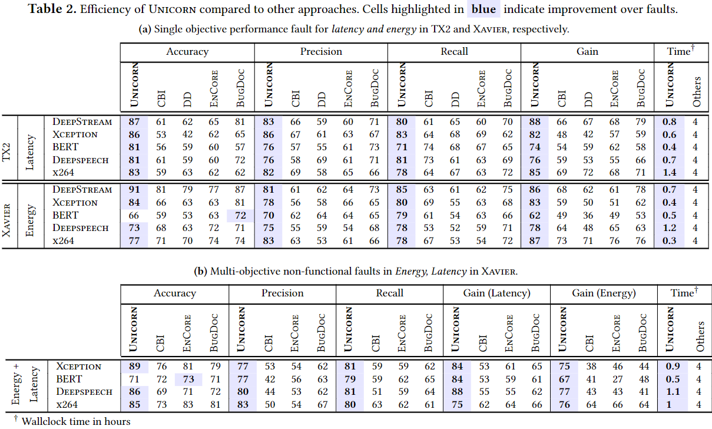

# Testing

## Hardware

Desktop:

- Intel Core i7-8700K CPU @ 3.50 GHz x 12
- 32 GB DDR4 RAM @ 3280MHz
- NVIDIA GeForce GTX 1080

Macbook:

- Apple M1 CPU @ 3.20 GHz x 4
- 16 GB LPDDR-DDR4X RAM @ 4266 MHz
- Apple M1 GPU

## Ziel der Reproduktion

- Möglich Optionen: `inference_time`, `total_energy_consumption`, `total_temp`

## Experimente

### Experiment 1

Bei diesem Experiment wird Tabelle 2 (Energieverbrauch für `Xception`) reproduziert.



```sh
docker-compose exec unicorn python ./tests/run_unicorn_debug.py -o total_energy_consumption -s Image -k Xavier -m offline
docker-compose exec unicorn python ./tests/run_baseline_debug.py -o total_energy_consumption -s Image -k Xavier -m offline -b cbi
docker-compose exec unicorn python ./tests/run_baseline_debug.py -o total_energy_consumption -s Image -k Xavier -m offline -b encore
docker-compose exec unicorn python ./tests/run_baseline_debug.py -o total_energy_consumption -s Image -k Xavier -m offline -b bugdoc
docker-compose exec unicorn python ./tests/run_debug_metrics.py -o total_energy_consumption -s Image -k Xavier -e debug
```
